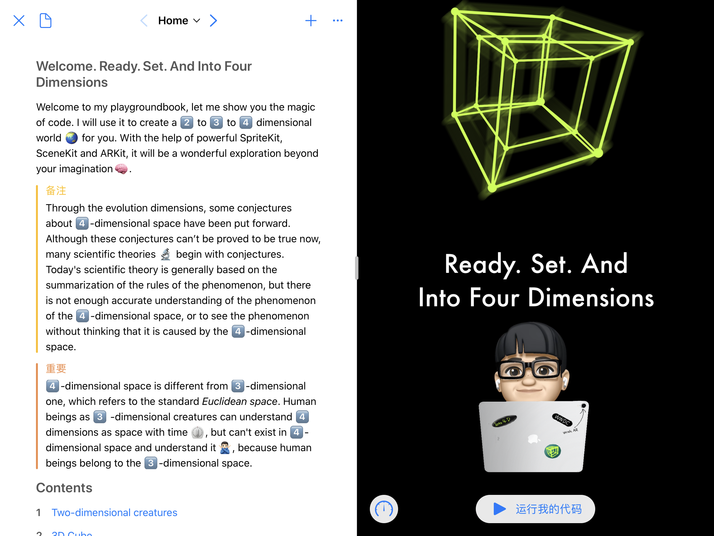
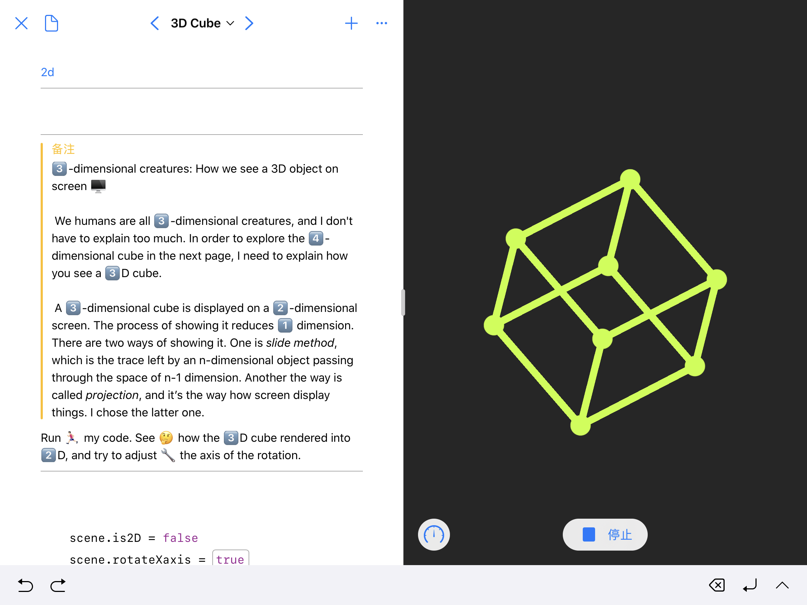
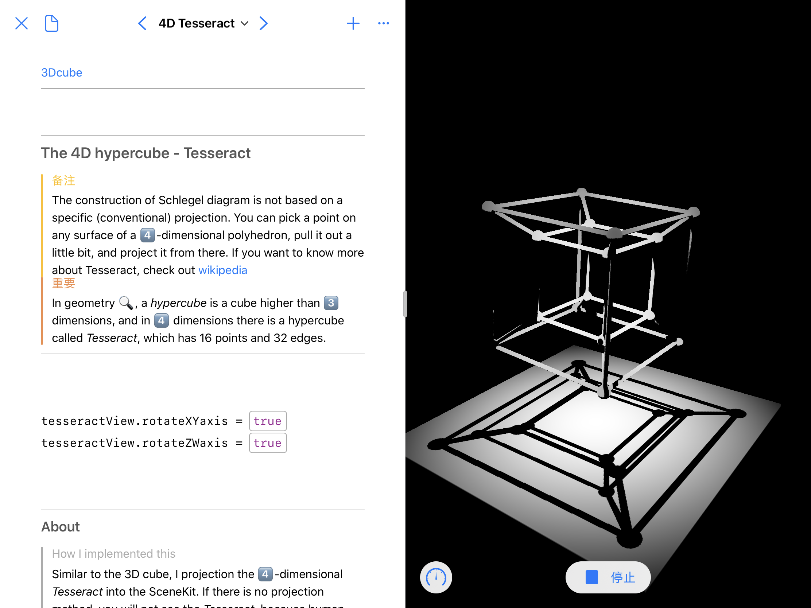

# WWDC2020-IntoFourDimensions
WWDC2020 Swift Student Challenge[Accepted] - IntoFourDimensions playground book

For more information, I make a [video](https://www.bilibili.com/video/BV1wK4y147Kg) here(in Chinese)

### About

This is a playground book about dimensions and visualization. I use SpriteKit, SceneKit and ARKit as graphical display frameworks. It will be a wonderful exploration beyond your imagination. 

### How I came up with this

I watched a documentary about dimensions and mathematics on a science channel a long time ago, explaining only the four dimensional objects in Euclidean space. I was deeply attracted and found it interesting to present this would be wonderful to create a four-dimensional mathematical world on the playground book.

### Implementation 

It provides readers with the explanation and visualization from the second dimension to the third dimension to the fourth dimension. I showed what a three-dimensional objects look like to two-dimensional creatures. And implement this by using SpriteKit. Then I used the basic techniques of computer vision to render three-dimensional objects in a two-dimensional framework, which is also implemented by using SpriteKit. I'm use this to explain how three-dimensional objects can be seen and understood by three-dimensional creatures, which is humans. 

Then on top of that, I used it to implement a four-dimensional hypercube, rendered on SceneKit, which can also be viewed as ar. A hypercube named Tesseract is the best part of this playground book. Tesseract is a four-dimensional object with 16 points, and I use it as the explanation and visualization of the four-dimensional space.  What is interesting is that its form is not fixed, but I present it through basic computer vision and matrix computing skills. Maybe you realize I didn't put the ar Tesseract in front of the camera. You can think of the last page as an explanation. Finally, by making the user try to move the Tesseract, you'll find that you can't move it. I use this to show that humans as three-dimensional creatures can not interact with four-dimensional objects.

These functions above are displayed in playground in real time through matrix operation. They're not videos, and they're the real time rendering result of every frame.

To compute geometric spaces and connect the points in space, I wrote code about geometry. It uses a lot of the mathematics of trigonometry.

### Techs

This playground book has used a lot of matrix and mathematical knowledge, especially matrix multiplication, and the code of mathematical calculations are all written by me. I spent a lot of time writing my own swift matrix operation code to use in this playground book. It also includes some basic computer vision knowledge about graphics rendering techniques.

